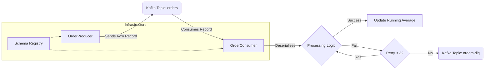

Here is a professional `README.md` file tailored exactly to your project. It includes a Mermaid diagram (which renders as a visual chart in GitHub/GitLab) and a clear explanation of the architecture.

You can copy-paste this raw text directly into a file named `README.md` in your project root.

-----

# Kafka Order Processing System

A robust, real-time stream processing application built with **Java**, **Apache Kafka**, and **Avro Serialization**. This system simulates an e-commerce order stream, calculates real-time pricing analytics, and handles system failures gracefully using Retry patterns and a Dead Letter Queue (DLQ).

## 📖 Project Overview

This project demonstrates a "Big Data" microservices architecture. It consists of a Producer that generates synthetic order data and a Consumer that processes these orders to calculate a running average of sales prices.

**Key Features:**

  * [cite\_start]**Stream Processing:** Real-time aggregation of order prices[cite: 5].
  * [cite\_start]**Data Serialization:** Uses **Apache Avro** and Confluent Schema Registry for efficient, strongly-typed data exchange[cite: 4].
  * **Fault Tolerance:**
      * [cite\_start]**Retry Logic:** Automatically retries processing upon temporary failures[cite: 6].
      * [cite\_start]**Dead Letter Queue (DLQ):** Redirects permanently failed messages to a separate topic (`orders-dlq`) for later inspection[cite: 7].

-----

## 🏗 Architecture

The system follows a decoupled Event-Driven Architecture.

### Data Flow Diagram



### Component Breakdown

1.  **Infrastructure (Docker):**

      * **Zookeeper:** Manages the cluster state.
      * **Kafka Broker:** The central log storage for events.
      * **Schema Registry:** Stores the Avro schema (`order.avsc`) to ensure data contract validity between Producer and Consumer.

2.  **The Producer (`OrderProducer.java`):**

      * [cite\_start]Generates random orders with fields: `orderId`, `product`, `price`[cite: 12].
      * Serializes data into binary Avro format.
      * Publishes to the `orders` topic.

3.  **The Consumer (`OrderConsumer.java`):**

      * Listens to the `orders` topic.
      * Deserializes Avro back to the Java `Order` object.
      * Maintains a stateful `running average` calculation.
      * Implements a `try-catch` block for retries and routing to the DLQ.

-----

## 🛠 Tech Stack

  * **Language:** Java 11+
  * **Build Tool:** Maven
  * **Message Broker:** Apache Kafka (Confluent Community Edition)
  * **Serialization:** Apache Avro
  * **Containerization:** Docker & Docker Compose

-----

## 🚀 Getting Started

### 1\. Prerequisites

  * Docker Desktop installed and running.
  * Java JDK 11 or higher.
  * Maven installed (or use IntelliJ's bundled Maven).

### 2\. Start Infrastructure

The project requires Zookeeper, Kafka, and Schema Registry to be running.

```bash
docker-compose up -d
```

*Wait 30 seconds for the containers to fully initialize.*

### 3\. Build the Project

This step generates the Java sources from the Avro schema file.

```bash
mvn clean install
```

### 4\. Run the Application

**Step A: Start the Consumer**
Run the `OrderConsumer` class. It will start up and wait for data.

> *Console Output:* `Consumer Started...`

**Step B: Start the Producer**
Run the `OrderProducer` class.

> *Console Output:* `Sent Order: 1001 Price: 55.0`

**Step C: Observe Analytics**
Check the Consumer console to see the real-time aggregation:

> *Console Output:* `Order: 1001 | Price: 55.00 | Running Avg: 55.00`

-----

## 🧪 Testing Resilience (Chaos Engineering)

### Scenario 1: The "Bad Data" Test (DLQ)

To verify the Dead Letter Queue:

1.  Modify `OrderConsumer.java` to throw an exception if `price > 100`.
2.  Run the application.
3.  Observe that high-priced orders are logged as "Permanently failed" and sent to `orders-dlq`.

### Scenario 2: The "Broker Crash" Test

To verify the buffering and reconnection:

1.  Start Producer and Consumer.
2.  Run `docker-compose stop kafka`.
3.  Observe the Consumer retry logs and Producer buffering.
4.  Run `docker-compose start kafka`.
5.  Observe the system recover and process backlog messages.

-----

## 📂 Project Structure

```text
├── docker-compose.yml       # Infrastructure definition
├── pom.xml                  # Maven dependencies & Avro plugin
├── src/
│   ├── main/
│   │   ├── java/
│   │   │   └── com/assignment/kafka/
│   │   │       ├── OrderProducer.java
│   │   │       └── OrderConsumer.java
│   │   └── resources/
│   │       └── avro/
│   │           └── order.avsc    # Avro Schema Definition
```
